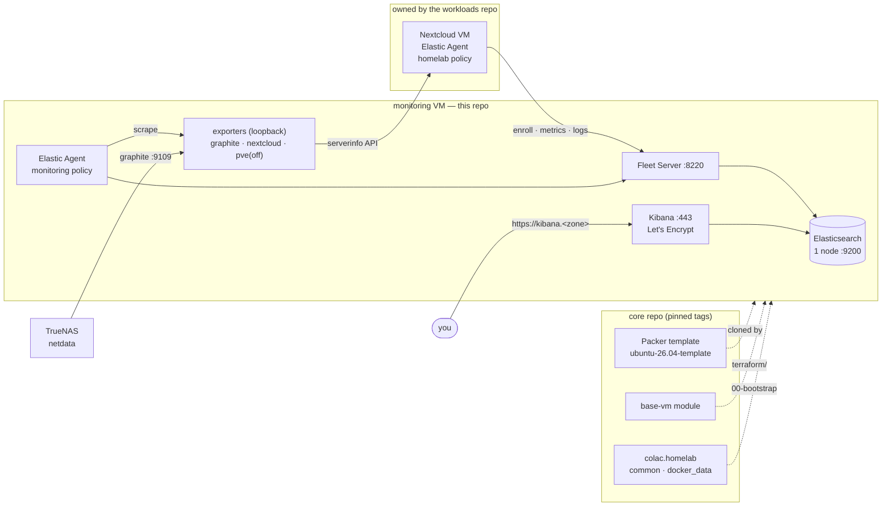

# Homelab Proxmox — Monitoring

The **observability layer** of the homelab: the Elastic Stack on one Proxmox
VM (single-node Elasticsearch, Kibana and Fleet Server), a Fleet-managed
Elastic Agent on every host, and Prometheus exporters for what Elastic has no
integration for (TrueNAS, Nextcloud's application metrics).

One of three repos, each owning one layer:

| Repo | Layer | Owns |
|---|---|---|
| [homelab-proxmox](https://github.com/colac/homelab-proxmox) | **core** | Packer templates, the `base-vm` Terraform module, the `colac.homelab` Ansible collection, homelab-wide architecture |
| **homelab-proxmox-monitoring** (this) | **monitoring** | The monitoring VM, the Elastic Stack, agent enrollment on every host |
| [homelab-proxmox-workloads](https://github.com/colac/homelab-proxmox-workloads) | **workloads** | The apps: Nextcloud now, k3s next |

The homelab-wide picture — how the layers fit, what each publishes and
consumes — is in the core repo's
[docs/ARCHITECTURE.md](https://github.com/colac/homelab-proxmox/blob/main/docs/ARCHITECTURE.md).

- **Deploying it from zero?** [RUNBOOK.md](RUNBOOK.md).
- **Working on the roles?** [ansible/README.md](ansible/README.md).
- **Resizing the VM?** [terraform/README.md](terraform/README.md).
- **What is done and what is not?** [TODO.md](TODO.md).

## Architecture



| Path | How | Why |
|---|---|---|
| Every VM | Elastic Agent, Fleet-managed, System + Docker integrations | Policy is pushed from Kibana, so adding an integration is not a playbook change |
| TrueNAS | Reporting Exporter → Graphite → `graphite_exporter` → agent's Prometheus integration | Not Ansible-managed, cannot take an agent |
| Nextcloud app metrics | `nextcloud-exporter` → Prometheus integration | Elastic ships no integration for it |
| Proxmox host | `prometheus-pve-exporter` | Scaffolded, off — see [TODO.md](TODO.md) |

**Why one VM:** the six-VM version lives in `homelab-proxmox-elastic`; that
topology is more than the 32 GB mini-PC has spare alongside Nextcloud. APM,
tracing and the OTel demo were given up to fit — full-text log search,
Fleet-managed agents and the path to OSQuery/Elastic Security were not.
**If a change needs a second monitoring VM, it belongs in that repo.**

### What this repo consumes, and what consumes it

| Contract | Direction | Where it is pinned |
|---|---|---|
| Template `ubuntu-26.04-template`, with the ES prerequisites baked in | core → here | `terraform/variables.tf` `template_name` |
| `base-vm` module | core → here | `terraform/main.tf` `?ref=v2.0.1` |
| `colac.homelab` collection | core → here | `ansible/requirements.yml` `version: v2.0.1` |
| Agent targets (the hosts to enroll) | workloads → here | `ansible/inventory/hosts.yml` (hand-authored) |
| `nextcloud_serverinfo_token` minted on the Nextcloud VM | workloads → here | this repo's `secrets.yaml` |
| DNS: `kibana.<zone>` → this VM | here → core | `pihole_local_records` in core's [`dns/`](https://github.com/colac/homelab-proxmox/blob/main/dns/README.md) — a PR to core |

## Quick start

```bash
mise trust && mise install        # pinned tools (Terraform, sops, Python, …)
mise run setup                    # venv deps, collections, hooks
mise run secrets:edit             # fill secrets.yaml — keys in secrets.yaml.example
mise run secrets:check            # every key present? (prints names, never values)

mise run tf:plan && mise run tf:apply
cp ansible/inventory/hosts.yml.example ansible/inventory/hosts.yml   # agent targets
mise run play playbooks/site.yml
mise run play playbooks/99-healthcheck.yml
```

`mise tasks` lists everything. Arguments after a task name go straight to the
tool: `mise run play playbooks/35-kibana.yml --check --diff`.

## Secrets

All in `secrets.yaml` (SOPS-encrypted, committed as ciphertext; keys in
`secrets.yaml.example`). Nothing is exported into your shell —
`.mise/sops-exec` decrypts it for one command:

| Profile | Used by | Gets |
|---|---|---|
| `terraform` | `mise run tf…` | the Proxmox and Terraform Cloud tokens |
| `ansible` | `mise run play` | the Elastic passwords and key, Kibana's Cloudflare token, the exporter tokens |

How to issue and rotate each one: core's
[CREDENTIALS.md](https://github.com/colac/homelab-proxmox/blob/main/docs/CREDENTIALS.md). Fleet's tokens and the internal CA
are generated by the roles and cached in `ansible/.secrets-cache/` and
`ansible/.certs/` — git-ignored machine state, not credentials you issue.

## Development

Tools, tasks, conventions and how to roll out a new core version are shared
by all three repos: core's [DEVELOPMENT.md](https://github.com/colac/homelab-proxmox/blob/main/docs/DEVELOPMENT.md).
AI agents: [AGENTS.md](AGENTS.md).
